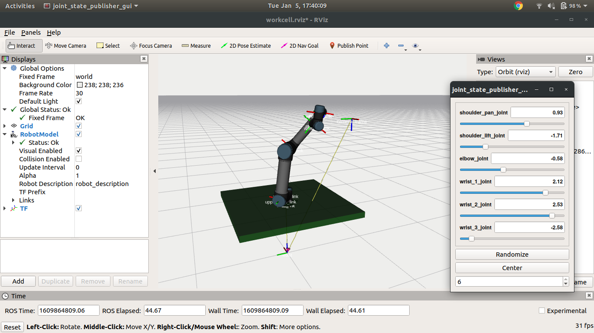

- Running the `urdf.launch` file should start rviz visualization as shown below

**NOTE:** As `joint-state-publisher` ros package is deprecated, you need to install `joint-state-publisher-gui`

`sudo apt-get install ros-melodic-joint-state-publisher-gui` 
